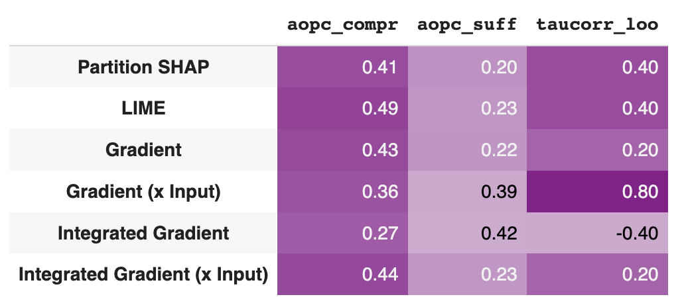
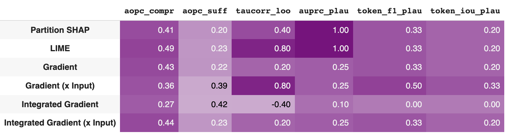

.. _benchmarking:

*****************************
Benchmarking
*****************************

In this page, we show how to use evaluate and compare a set of explanations with our built-in benchmarking methods.

Given a set of explanations from multiple explainers as described in the :ref:`Explaining <explaining>` section, we are interested in quantitatively evaluate and comparing them.
ferret offers multiple measures which evaluate both the :ref:`faithfulness <benchmarking-faithfulness>` and plausibility of explanations.

.. _benchmarking-faithfulness:

Evaluate faithfulness
=======================
Faithfulness evaluates how accurately the explanation reflects the inner working of the model (Jacovi and Goldberg, 2020).

ferret offers the following measures of faithfulness:

- :ref:`AOPC Comprehensiveness <faithfulness-aopc_compr>` - (aopc_compr, ↑) -  goes from 0 to 1 (best)
- :ref:`AOPC Sufficiency <faithfulness-aopc_suff>` - (aopc_suff, ↓)) -  goes from 0 (best) to 1;
- :ref:`Kendall's Tau correlation with Leave-One-Out token removal <faithfulness-taucorr_loo>` - (taucorr_loo, ↑) - goes from -1 to 1 (best).

The Benchmark class exposes the **evaluate_explanations** method to evaluate the explanations produced. 
If no parameters are specified, we compute all supported faithfulness measures for all explanations.

..  code-block:: python

    explanation_evaluations = bench.evaluate_explanations(explanations, target=2)

We can visualize the faithfulness result in a tabular form using the **show_evaluation_table** method.

..  code-block:: python

    bench.show_evaluation_table(explanation_evaluations)

Here there is the output for our example.

.. _benchmarking-plausibility:

Evaluate plausibility
=======================
Plausibility reflects how explanations are aligned with human reasoning.

ferret offers the following measures of plausibility:

- :ref:`Area-Under-Precision-Recall-Curve <plausibility-auprc_plau>` - (auprc_plau, ↑) -  goes from 0 to 1 (best)
- :ref:`Token F1 <plausibility-token_f1_plau>` - (token_f1_plau, ↑) -  goes from 0 to 1 (best);
- :ref:`Token Intersection Over Union <plausibility-token_iou_plau>` - (taucorr_loo, ↑) - goes from 0 to 1 (best).

The evaluation is performed by comparing explanations with human rationales.

**Human rationales** are annotations highlighting the most relevant words a human annotator attributed to a given class label.

To evaluate the plausibility of explanations for our input text, we need to specify the human rationales, i.e., which tokens we expect to be salient.
In ferret, we represent human rationale as a list with values 0 or 1. A value of 1 means that the corresponding token is part of the human rationale, 0 otherwise.

In our example with the text 'I love your style!', 'love' and '!' could be the tokens we associate to a positive sentiment (class 2 in our example) as humans.

We specify the human rationale as input to the evaluate_explanations method. ferret will evaluate plausibility measures (and faithfulness) for our explanations.

..  code-block:: python

    human_rationale = {"▁I": 0, "_love": 1, "_your": 0, "_style": 0, "!": 0}
    
    evaluations = bench.evaluate_explanations(explanations, target=2, human_rationale=list(human_rationale.values()))

We can visualize both the faithfulness result and the plausibility ones using the **show_evaluation_table** method.

..  code-block:: python

    bench.show_evaluation_table(explanation_evaluations)

Here there is the output for our example.

