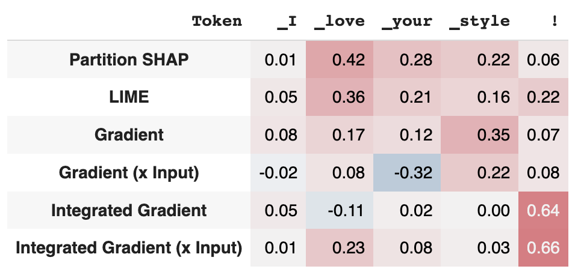

.. _explaining:

**********
Explaining
**********

In this page, we show how to use ferret's built-in explainers to generate post-hoc feature attribution scores on a simple text.

:ref:`Post-hoc feature attribution methods <notions.explainers>` explain why a model made a specific prediction for a given text. 
These methods assign an importance score to each input. In the context of text data, we typically assign a score to each token, and so in ferret.
Given a model, a target class, and a prediction, ferret lets you measure how much each token contributed to that prediction.

ferret integrates multiple post-hoc feature attribution methods: Gradient, GradientXInput, Integrated Gradient, SHAP, LIME. 
We can explain a prediction with the multiple supported approaches and visualize explanations.

.. _explain-predictions:

Explain predictions
======================

ferret offers direct integration with Hugging Face models and naming conventions. Hence, we can easily explain Hugging face models for text classification.

Consider a common text classification pipeline

..  code-block:: python

    from transformers import AutoModelForSequenceClassification, AutoTokenizer
    from ferret import Benchmark

    name = "cardiffnlp/twitter-xlm-roberta-base-sentiment"
    tokenizer = AutoTokenizer.from_pretrained(name)
    model = AutoModelForSequenceClassification.from_pretrained(name)

.. _generate-explanations:

Generate explanations
----------------------------

We first specify the model and tokenizer in use through the ferret's main API access point, the `Benchmark` class. 
If we do not initialize with any additional parameters, we will use by default all supported post-hoc explainers with default parameters. 
Each explainer will provide a list of feature importance scores that quantify of *large* was the contribution of the token to a target class.
A positive attribution score indicates that the token positively contributed to the final prediction.

We can explain the the prediction for a given input text with respect to a target class directly using the **explain** method.

..  code-block:: python

    from ferret import Benchmark
    bench = Benchmark(model, tokenizer)
    explanations = bench.explain('I love your style!', target=2)  

The **explain** method returns a list of Explanations, one for each explainer. An **Explanation** has the following form.

.. code-block:: python
    
    Explanation\(text='I love your style!', tokens=['<s>', '▁I', '▁love', '▁your', '▁style', '!', '</s>'], scores=array([-6.40356006e-08,  1.44730296e-02,  4.23283947e-01,  2.80506348e-01, 2.20774370e-01,  6.09622411e-02,  0.00000000e+00]), explainer='Partition SHAP',  target=2)

It stores the input text, the tokens, the importance **score** for each token, the explainer name and the target class.

.. _visualize-explanations:

Visualize explanations
----------------------------

We can visualize the explanations using the **show_evaluation_table** method.

..  code-block:: python

    bench.show_table(explanations)

Here there is the output for our example.

