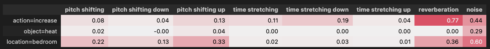
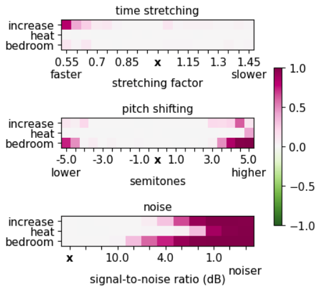

.. _speechxai:

*****************************
Speech XAI
*****************************

ferret offers Speech XAI functionalities through the `SpeechBenchmark` class (analogous to the `Benchmark` one for text data). We provide two types of insights. 🚀

- Word-level. We measure the impact of each audio segment aligned with a word on the outcome. 

- Paralinguistic. We evaluate how non-linguistic features (e.g., prosody and background noise) affect the outcome if perturbed.

Explanation
===========
The code below provides a minimal example on how to generate word-level audio segment and paralinguistic attributions.

We start by loading the model to explain

..  code-block:: python

    from transformers import Wav2Vec2ForSequenceClassification, Wav2Vec2FeatureExtractor

    model = Wav2Vec2ForSequenceClassification.from_pretrained("superb/wav2vec2-base-superb-ic")
    feature_extractor = Wav2Vec2FeatureExtractor.from_pretrained("superbwav2vec2-base-superb-ic")

We generate explanations by simply specifying the path of the audio to explain.

Here we derive word-level audio segment explanation via the leave-one-out technique:

..  code-block:: python

    from ferret import SpeechBenchmark

    speech_benchmark = SpeechBenchmark(model, feature_extractor)

    explanation = speech_benchmark.explain(
        audio_path=audio_path, 
        methodology='LOO')

    display(speech_benchmark.show_table(explanation, decimals=3)),

.. image:: _speechxai_images/example_word-level-audio-segments-loo.png
  :width: 400
  :alt: Example of word-level audio segment explanation

Here we derive paralinguistic attributions

..  code-block:: python

    paraling_expl = speech_benchmark.explain(
        audio_path=audio_path,
        methodology='perturb_paraling',
        )

    display(speech_benchmark.show_table(paraling_expl, decimals=2))

We can also plot the impact on the prediction probability when varying the degree of perturbations of the paralinguistic features:

..  code-block:: python

    variations_table = speech_benchmark.explain_variations(
        audio_path=audio_path,
        perturbation_types=['time stretching', 'pitch shifting', 'reverberation'])

    speech_benchmark.plot_variations(variations_table, show_diff = True);

Evaluation
==========
We can evaluate the faithfulness of our word-level segment explanation in terms of comprehensiveness and sufficiency:

..  code-block:: python

    from ferret import AOPC_Comprehensiveness_Evaluation_Speech, AOPC_Sufficiency_Evaluation_Speech

    aopc_compr = AOPC_Comprehensiveness_Evaluation_Speech(speech_benchmark.model_helper)
    evaluation_output_c = aopc_compr.compute_evaluation(explanation)

    aopc_suff = AOPC_Sufficiency_Evaluation_Speech(speech_benchmark.model_helper)
    evaluation_output_s = aopc_suff.compute_evaluation(explanation)
