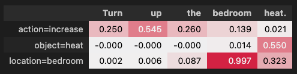

# SpeechXAI 

We propose a novel approach to explain speech classification models 🗣️💬

We provide two types of insights. 🚀

(i) Word-level. We measure the impact of each audio segment aligned with a word on the outcome. 

(ii) Paralinguistic. We evaluate how non-linguistic features (e.g., prosody and background noise) affect the outcome if perturbed.


## How-to  

The code below provides a minimal example on how to generate word-level audio segment and paralinguistic attributions.

We start by loading the model to explain
```python
from transformers import Wav2Vec2ForSequenceClassification, Wav2Vec2FeatureExtractor

model = Wav2Vec2ForSequenceClassification.from_pretrained("superb/wav2vec2-base-superb-ic")
feature_extractor = Wav2Vec2FeatureExtractor.from_pretrained("superbwav2vec2-base-superb-ic")
```

#### Generate attributions 

We generate explanations by simply specify the path of the audio to explain.

Here we derive word-level audio segment explanation via the leave-one-out technique:
```python
from ferret import SpeechBenchmark

benchmark = Benchmark(model, feature_extractor)

explanation = benchmark.explain(
    audio_path=audio_path, 
    methodology='LOO')

display(benchmark.show_table(explanation, decimals=3)),
```



Here we derive paralinguistic attributions
```python
paraling_expl = benchmark.explain(
        audio_path=audio_path,
        methodology='perturb_paraling',
        )

display(benchmark.show_table(paraling_expl, decimals=2));
```


We can also plot the impact on the prediction probability when varying the degree of perturbations of the paralinguistic features:
```python

variations_table = benchmark.explain_variations(
        audio_path=audio_path,
        perturbation_types=['time stretching', 'pitch shifting', 'reverberation'])

benchmark.plot_variations(variations_table, show_diff = True);
```


#### Evaluate 

We can evaluate the faithfulness of our word-level segment explanation in terms of comprehensiveness and sufficiency:

``` python

from ferret import AOPC_Comprehensiveness_Evaluation_Speech, AOPC_Sufficiency_Evaluation_Speech

aopc_compr = AOPC_Comprehensiveness_Evaluation_Speech(benchmark.model_helper)
evaluation_output_c = aopc_compr.compute_evaluation(explanation)

aopc_suff = AOPC_Sufficiency_Evaluation_Speech(benchmark.model_helper)
evaluation_output_s = aopc_suff.compute_evaluation(explanation)
```